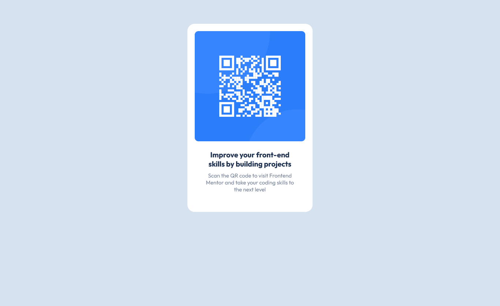

# Frontend Mentor - QR code component solution

## Table of contents

- [Overview](#overview)
  - [Screenshot](#screenshot)
  - [Links](#links)
- [My process](#my-process)
  - [Built with](#built-with)
- [Author](#author)

## Overview

### Screenshot

### Links

- Solution URL: https://amirabenguega.github.io/QR-code-component/

## My process

### Built with

- Semantic HTML5 markup
- CSS custom properties

## Author

- Website - [Amira Benguega]
- Frontend Mentor - [@AmiraBenguega](https://www.frontendmentor.io/profile/AmiraBenguega)
